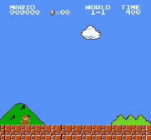
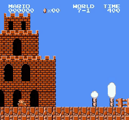

# Mario RL

PPO agents that learn Super Mario Bros. (NES) from two different observation
pipelines: raw console RAM fed to an MLP, and 84x84 grayscale frames fed to a
CNN. Built on [Stable-Retro](https://github.com/Farama-Foundation/stable-retro)
and [Stable-Baselines3](https://stable-baselines3.readthedocs.io/).

The pixel agent clears World 1-1 in **5 out of 5 evaluation episodes** after 5M
steps. Every episode below ends on the World 1-2 transition card, which is the
emulator's own proof that Mario touched the flagpole.

<p align="left">
  
  
</p>

Left: 5M steps, full clear. Right: the same architecture at 500k steps. It has
worked out that right is good and stomped a Goomba, but it gets stuck at the
first pipe and never finishes. Both clips are sped up 2.5x.

## Why RAM

Nearly every Mario RL project is pixels into a CNN. I wanted to know what
happens if you skip the vision problem entirely and hand the policy the
console's memory, where Mario's x-position, velocity, enemy slots, and the
timer already exist as plain integers. No convolution needed to recover the
state, because the state is right there.

It worked worse, and that turned out to be the more interesting result. The
Retro integration exposes the memory as a 10240-value vector, and most of those
bytes have nothing to do with playing the level. The MLP has to learn which
handful matter, with no structural prior telling it that byte 0x86 and byte 0x87
are related. The CNN gets locality for free: adjacent pixels are adjacent
things, and convolution is built to exploit exactly that. Handing the network
the ground truth in a format it can't exploit lost to handing it a picture.

The fix I'd try next is not more steps. It's cutting the observation down to the
30 or so addresses that actually encode game state, which the Retro integration
already names in its data file.

## Results

Everything here was verified by replaying the saved evaluation videos and
reading the game's own HUD, not from training-time reward curves.

| Agent | Level | Steps | Outcome |
|---|---|---:|---|
| CNN (NatureCNN, pixels) | 1-1 | 5M | 5/5 episodes clear the flagpole |
| CNN (NatureCNN, pixels) | 1-1 | 500k | 0/5, stalls at the first pipes |
| RecurrentPPO (CNN+LSTM) | 7-1 | 5.5M | 0/5 clears, dies at the Hammer Bros. |
| MLP (RAM) | 7-1 | 30M | 0/5 clears, dies at the cannons |

The World 1-1 RAM baseline (`models/ppo_26500000_steps.zip`, 26.5M steps) ran
earlier in the project and I did not keep evaluation videos for it, so it is not
in the table. I'm not going to claim a number I can't reproduce from what's in
the repo.

### World 7-1 is unsolved

<p align="left">
  
</p>

7-1 is a Bullet Bill and Hammer Bros. gauntlet, and it's where the project
stops. The recurrent agent gets through the opening cannons and reaches roughly
the middle of the level, then dies to the Hammer Bros. The clip above is a
representative run, not a best-case one.

I gave this agent an LSTM specifically because 7-1 punishes memoryless policies.
Hammer Bros. throw on a cycle, and the right move depends on where in that cycle
you are, which a single stacked-frame observation can't tell you. It helped with
the cannons. It did not solve the Hammer Bros., which need a jump timed through a
gap that random exploration almost never stumbles into.

## What didn't work

- **A GPU barely helped.** The emulator is the bottleneck and it runs on CPU.
  The fix was 16 parallel environments, not a faster card.
- **Mario went unpunished for dying** for a whole stretch of training, because
  the episode ended before the reward wrapper could see the death. He learned to
  be suicidal. Fixed in `fdcc031`.
- **Bullet Bills are farmable.** The 7-1 cannons spawn forever, so the agent
  parked next to one and collected kill rewards instead of finishing. Capped
  per-episode kill reward and moved the payout to the flag.
- **Then I over-punished stalling,** which trained out the waiting that 7-1
  actually requires against Hammer Bros. Widened the window to 48 steps.
- **Guessing the flag's x-position** let the agent claim the completion bonus
  without clearing the hard section. Now it watches the RAM level bytes instead.

## Setup

Python 3.10 to 3.12. The ROM is not in this repo, for the obvious copyright
reason. Drop your own legally obtained Super Mario Bros. `.nes` file into
`roms/` and Stable-Retro will import it.

```bash
uv sync
source .venv/bin/activate
cp /path/to/your/rom.nes roms/
python -m stable_retro.import roms/
mario-doctor
```

`mario-doctor` checks the ROM imported and both observation modes build. Apple
Silicon pulls `stable-retro-apple-silicon`, everything else pulls `stable-retro`;
`pyproject.toml` handles the split, and every version is pinned because the
combination that works is narrow.

Quick check that both pipelines step:

```bash
mario-smoke --state Level1-1 --obs-mode ram --steps 300
mario-smoke --state Level1-1 --obs-mode pixel --steps 300
```

## Training

The 1-1 result above:

```bash
mario-train \
  --obs-mode pixel \
  --state Level1-1 \
  --timesteps 5000000 \
  --n-envs 8 \
  --n-steps 128 \
  --batch-size 512 \
  --run-name cnn-1-1
```

The 7-1 recurrent run:

```bash
mario-train \
  --algo recurrent-ppo \
  --obs-mode pixel \
  --state Level7-1 \
  --timesteps 5500000 \
  --n-envs 8 \
  --run-name cnn-7-1
```

Runs auto-resume from the newest checkpoint in the run directory, because Colab
disconnects. Pass `--no-auto-resume` to start clean.

Training is locked to one level by default: when Mario clears the flag, the
episode ends and resets to the same state instead of continuing into the next
level. `--no-flag-lock` turns that off.

Evaluate and record:

```bash
mario-eval \
  --model models/cnn/cnn-1-1/ppo_5000000_steps.zip \
  --obs-mode pixel \
  --state Level1-1 \
  --episodes 5 \
  --flag-lock \
  --video-dir videos/cnn-1-1
```

`mario-eval` prints score, coins, max x-position, and the reward-component
breakdown per episode. Pass `--flag-lock` to stop each episode at the level
transition, which is how the clips above end on the World 1-2 card.

## How it fits together

```text
Stable-Retro emulator
  -> MarioActionSpace      11 discrete actions instead of MultiBinary(9)
  -> RAM or pixel observation wrapper
  -> ActionRepeat          4 emulator frames per agent step
  -> FrameStack            pixels only, 4 frames, for velocity
  -> SingleLifeEpisode     one death ends the episode
  -> FlagLockEpisode       level transition ends the episode
  -> SmartMarioReward      per-level shaping profile
  -> PPO / RecurrentPPO
```

`make_mario_env()` in `src/mario_rl/env.py` is the single construction path, so
training, evaluation, and smoke tests can't drift apart. Reward numbers live in
`src/mario_rl/reward_profiles/`, one file per level, because 1-1 and 7-1 want
genuinely different things.

The action space is 11 hand-picked actions rather than the raw 9-button
controller. It drops START, SELECT, and LEFT+RIGHT, so the policy never spends
exploration budget learning that pressing START is bad.

Longer notes: [architecture](docs/ARCHITECTURE.md),
[reward design](docs/REWARD.md), [action space](docs/ACTIONS.md),
[Colab](docs/COLAB.md), [local setup](docs/PC_SETUP.md),
[GPU emulator benchmarks](docs/NESLE_A100.md).

## Built on

- [Stable-Retro](https://github.com/Farama-Foundation/stable-retro) for NES emulation and the Mario integration
- [Stable-Baselines3](https://github.com/DLR-RM/stable-baselines3) and [SB3-Contrib](https://github.com/Stable-Baselines-Team/stable-baselines3-contrib) for PPO and RecurrentPPO
- [PPO](https://arxiv.org/abs/1707.06347) (Schulman et al., 2017)
- [Human-level control through deep RL](https://www.nature.com/articles/nature14236) (Mnih et al., 2015), the source of the NatureCNN architecture
